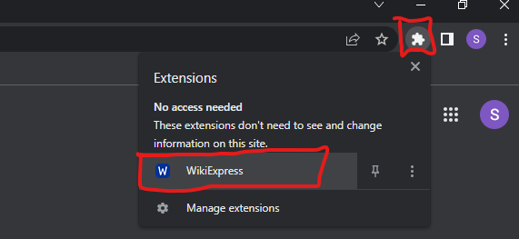

# WikiExpress
WikiExpress is a convenient Chrome Extension designed to simplify the process of searching for unfamiliar concepts and definitions using Wikipedia. With WikiExpress, you can effortlessly access and read concise definitions or descriptions of various subjects. If you find a particular topic intriguing, you can seamlessly navigate to the corresponding Wikipedia page. The extension functions as a handy popup within your browser, eliminating the need to open a new tab in Chrome.

## Dependencies
| Requierment     | Version |
| ----------- | ----------- |
| Chrome Browser     | 80+      |

## Demo
After successfully installing and loading the WikiExpress extension on your Chrome Browser, you can easily access the extension using any of the following methods:

### Open Extension

#### Manually open extension (1):
Open the extension menu on the top right corner and then press on the extension to open it:
  

#### Use Shortcut keys (2):
You can use your keyboar to quickly launch the extension using the keys:  
- Ctrl + b (Windows OS)  
- Command + b (Mac OS)
#### Landing page:
 
### How to wiki
The only thing that you need to now is to just type the subject(Bubble sort) that you want to learn about in the search bar and press enter or click on the search icon and your result will appear right under the search bar.

##### Search subject (1):
 

##### Get Results (2):
 

 If your query is not found but similar queries appear to exist in WikiPedia you can proced with the link provided to find out about similar topics. However, you need to becarefull to use correct spelling. Make learning easier and faster.

### Installation

### License 

