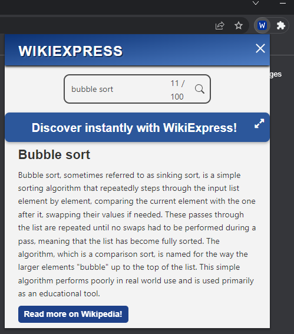

<p align="center">
  
</p>

<h1 align="center">Wiki Express</h1>

<p align="center">WikiExpress is a convenient Chrome Extension designed to simplify the process of searching for unfamiliar concepts and definitions using Wikipedia. With WikiExpress, you can effortlessly access and read concise definitions or descriptions of various subjects. If you find a particular topic intriguing, you can seamlessly navigate to the corresponding Wikipedia page. The extension functions as a handy popup within your browser, eliminating the need to open a new tab in Chrome.</p>


## Installation
To download the chrome extension, run the following script from the root of your project's directory:   

```
git clone https://github.com/StamTheo28/WikiExpress.git
```  

or 

download the [zip file](https://github.com/StamTheo28/WikiExpress/archive/refs/heads/main.zip) directly:


To install the Chrome extension, please follow these step-by-step instructions on the [install.md](install.md)

------

## Dependencies
| Requierment     | Version |
| ----------- | ----------- |
| Chrome Browser     | 80+      |

------

## Demo
This section includes a video and a step-by-step demonstration of how to operate the extension once it has been installed and enabled on the Chrome extension Manager.


https://github.com/StamTheo28/WikiExpress/assets/105800807/ee329355-db0f-4499-89da-0494d7ccddb6


### Step 1: Open Extension
You can easily access the extension using any of the following methods:

#### Use Shortcut keys (1):
You can use your keyboar to quickly launch the extension using the keys:  
- Ctrl + b (Windows OS)  
- Command + b (Mac OS)

#### Manually open extension (2):
Open the extension menu on the top right corner and then press on the extension to open it:


#### Landing page:


### Step 2: How to WikiExpress
The only thing that you need to now is to just type the subject(Bubble sort) that you want to learn about in the search bar and press enter or click on the search icon and your result will appear right under the search bar.

#### Search subject (1):


#### Get Results (2):



 If your query is not found but similar queries appear to exist in WikiPedia you can proced with the link provided to find out about similar topics. However, you need to becarefull to use correct spelling. Make learning easier and faster.

-----
## License 
 This project follows an [MIT License](LICENSE)
