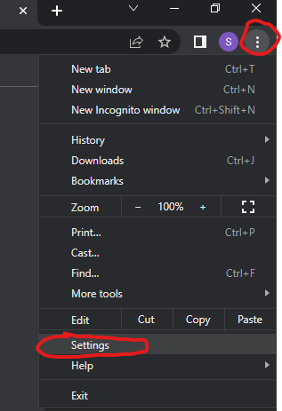
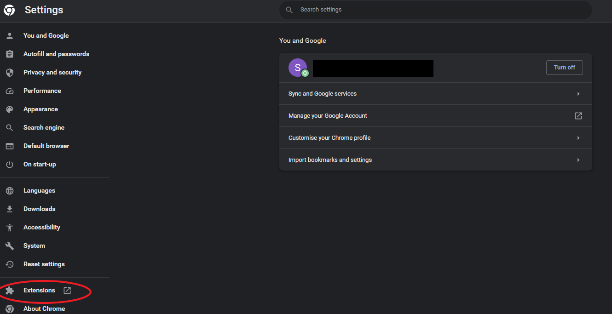
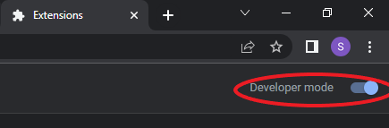
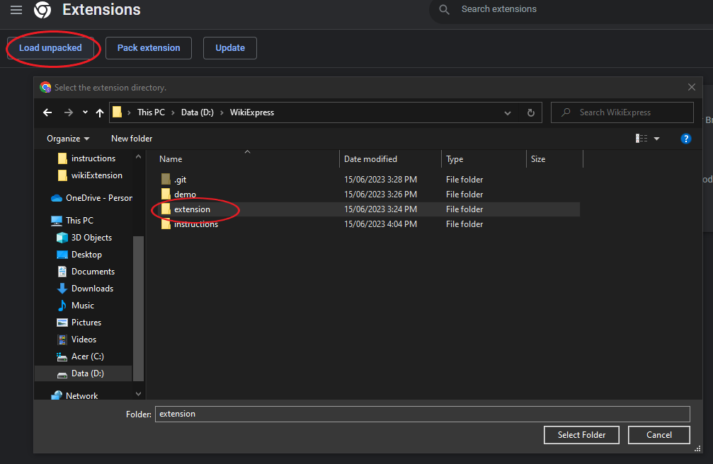
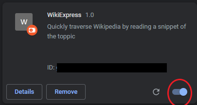

# Install Chrome Extension on your browser

### Step 1:
You have to go to chrome extension manager by pressing on your top right corner the three dots and press on the settings option

### Step 2:
In the chromes settings on the bottom left corner press the extentions option and you should be redirected in the chrome://extensions page.

If you cannot find such option you can use the search bar on the top of the settings page to look up for extensions

### Step 3:
In the extensions page you have to enable the developer mode on the top right corner:

### Step 4:
Press the Load unpacked option on the top left corner and find the extension on the directory you have downloaded it. It is important to select the extension folder which includes the chrome extension.

### Step 5:
Make sure that the WikiExpress is enabled and then you are good to go. For how to use it go use the following link on the [demo section](https://github.com/StamTheo28/WikiExpress#demo)

